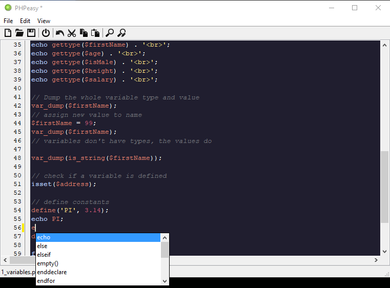
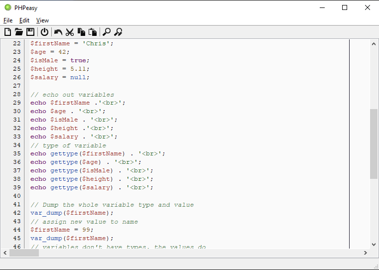

# PHPeasy
## A light PHP code editor

For when you just need an editor that opens quickly to edit a PHP file.  
  
 - Comment / uncomment lines by pressing CTRL + /
 - Autocomplete is called up by pressing CTRL + SPACE

Download from the [Releases](https://github.com/cyberfilth/PHPeasy/releases) page

